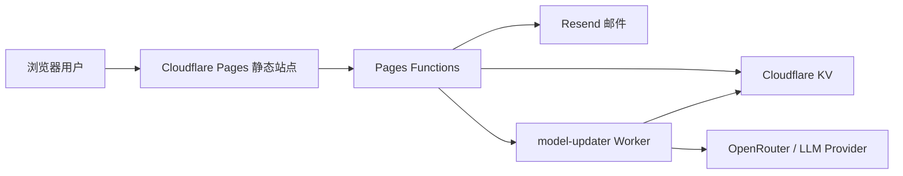

# EasyGoVibeCoding

[](https://nextjs.org/)
[](https://react.dev/)
[](https://www.typescriptlang.org/)
[](https://pages.cloudflare.com/)
[](LICENSE)

> AI 编程工具不是魔法，是工程。理解机制，才能真正驾驭工具。

EasyGoVibeCoding 是一个面向开发者、团队和企业的 AI 编程工具与架构培训平台。项目当前以 Next.js 静态站点为主体，结合 Cloudflare Pages Functions、KV 和定时 Worker，提供课程内容、模型动态、学习进度和真实反馈收集能力。

生产站点：`https://easy-go-vibe-coding.pages.dev`

## 核心能力

| 能力 | 当前实现 |
| --- | --- |
| 课程内容 | 基础、进阶、工具、架构、实践、团队、生态、资源、超级个体等模块 |
| 搜索体验 | Header 站内搜索对话框，支持快捷键入口 |
| 学习进度 | 浏览器本地访问/完成进度追踪，不依赖账号体系 |
| 最新模型 | Cloudflare Worker 定时刷新模型榜单，KV 存储，静态种子兜底 |
| 真实反馈 | 邮箱反馈 + 授权确认后公开展示，不使用虚假 testimonials |
| 站点统计 | Pages Functions 读取 KV 统计访问数据 |
| 多市场验证 | 日本站 MVP、等待名单和法务页面 |
| 部署链路 | Next.js static export + Cloudflare Pages + Pages Functions |

## 技术架构



### 技术栈

| 层级 | 技术 |
| --- | --- |
| Frontend | Next.js 16, React 19, TypeScript 5 |
| Styling | Tailwind CSS 4, shadcn/ui, Radix UI |
| UI assets | Lucide React, Recharts |
| Forms | React Hook Form, Zod |
| APIs | Cloudflare Pages Functions |
| Storage | Cloudflare KV |
| Jobs | Cloudflare Worker cron |
| Email | Resend |

## 项目结构

```text
EasyGoVibeCoding/
├── docs/                              # PRD、任务拆解、架构文档
├── src/
│   ├── frontend/EasyGoVibeCoding/     # Next.js 前端与 Pages Functions
│   │   ├── app/                       # App Router 页面
│   │   ├── components/                # 业务组件与 UI 组件
│   │   ├── data/                      # 静态种子数据
│   │   ├── functions/                 # Cloudflare Pages Functions
│   │   ├── lib/                       # 数据读取、schema、工具函数
│   │   └── scripts/                   # 构建和校验脚本
│   └── backend/model-updater/         # 定时刷新模型数据的 Worker
├── AI编程工具综合培训网站大纲.md
├── 模型信息更新记录.md
├── AGENTS.md
├── CLAUDE.md
└── README.md
```

## 快速开始

前端应用位于 `src/frontend/EasyGoVibeCoding/`，所有前端命令都应在该目录执行。

```bash
cd src/frontend/EasyGoVibeCoding
pnpm install
pnpm dev
```

本地访问：

```text
http://localhost:3000
```

常用命令：

| 命令 | 说明 |
| --- | --- |
| `pnpm dev` | 启动 Next.js 本地开发服务 |
| `pnpm build` | 校验模型种子并执行静态导出 |
| `pnpm pages:deploy` | 构建并部署到 Cloudflare Pages |
| `pnpm validate:models` | 校验 `data/models.json` |
| `pnpm typecheck:functions` | 校验 Pages Functions TypeScript |
| `pnpm lint` | 运行 ESLint，目前仍有历史 lint 待清理 |

## 模型更新 Worker

Worker 位于 `src/backend/model-updater/`，负责定时刷新首页模型动态并写入 KV。

```bash
cd src/backend/model-updater
pnpm install
pnpm typecheck
pnpm deploy
```

当前模型刷新策略：

- 优先尝试配置的 LLM provider。
- OpenRouter 免费模型不可用、超时或限流时，使用 OpenRouter 官方模型目录兜底。
- 首页第一梯队按 Anthropic / OpenAI / Google 御三家旗舰代表展示。
- `tier` 是能力分级，不是发布时间排序。
- 写入 KV 前会经过共享 schema 校验。

## 环境变量

敏感值只放在 Cloudflare Secrets 或本地 `.env.local`，不要提交到 Git。

### Pages / Functions

| 变量 | 用途 |
| --- | --- |
| `RESEND_API_KEY` | 发送反馈确认邮件 |
| `MODEL_UPDATER_TOKEN` | Pages 调用 Worker 的共享 token |
| `MODEL_UPDATER_URL` | 可选，公开 Worker URL 回退 |
| `NEXT_PUBLIC_SITE_URL` | 本地或生产站点 URL |

### Worker

| 变量 | 用途 |
| --- | --- |
| `RUN_TOKEN` | 手动触发 Worker 的鉴权 token |
| `OPENROUTER_API_KEY` | OpenRouter API Key |
| `LLM_PROVIDER` | 当前 LLM provider，默认可用 `openrouter` |
| `LLM_MODEL` | 主模型 |
| `LLM_MODEL_FALLBACKS` | 备用模型列表 |
| `HISTORY_MONTHS_TO_KEEP` | KV 历史保留月数 |

## 内容模块

| 模块 | 路由 |
| --- | --- |
| 首页 | `/` |
| 基础篇 | `/basics/*` |
| 进阶篇 | `/advanced/*` |
| 工具篇 | `/tools/*` |
| 架构篇 | `/architecture/*` |
| 实践篇 | `/practice/*` |
| 团队篇 | `/team/*` |
| 生态导航 | `/ecosystem` |
| 优质资源 | `/resources` |
| 超级个体篇 | `/super-individual/*` |
| GitHub 热门项目 | `/github-hot` |
| 日本站 MVP | `/ja/*` |

## 当前状态

已完成：

- 多模块课程页面和首页核心区块
- Cloudflare Pages 静态部署链路
- Pages Functions API：模型、统计、邮件反馈
- Worker + KV 模型动态刷新
- 本地学习进度追踪
- 真实邮箱反馈确认与公开展示
- 日本站 MVP 页面

待完善：

- 全量测试框架与 CI/CD
- lint 历史问题清理
- sitemap/robots 生成
- 账号体系和跨设备学习进度同步
- 更完整的问答式工具选型助手
- 邮件反馈的防滥用策略和后台审核体验

## 关键文档

| 文档 | 说明 |
| --- | --- |
| `docs/bussiness/PRD.md` | 产品需求和功能边界 |
| `docs/bussiness/Task_Details.md` | 任务拆解 |
| `docs/develop/Architecture_Design.md` | 架构设计和历史规划差异 |
| `src/frontend/EasyGoVibeCoding/CLOUDFLARE_DEPLOY.md` | Pages 部署说明 |
| `src/backend/model-updater/README.md` | 模型更新 Worker 说明 |
| `模型信息更新记录.md` | 模型数据维护记录 |

## 维护原则

- 内容更新优先修改 `app/**/page.tsx` 和现有组件，不默认引入 MDX 流程。
- 公开模型信息必须能追溯到官方文档、模型目录、发布页或可信榜单。
- 真实用户反馈必须经过邮箱授权确认后再公开展示。
- 新增 Cloudflare binding、secret 或 API 时，同步更新部署文档。
- 生产发布前应运行类型检查、模型数据校验和构建。

## License

[MIT](LICENSE)
